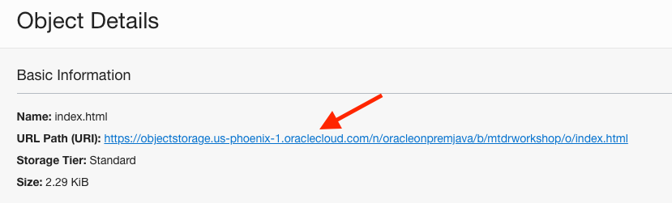

## MyToDoReact version 1.0.

Copyright (c) 2021 Oracle, Inc.

Licensed under the Universal Permissive License v 1.0 as shown at https://oss.oracle.com/licenses/upl/

# Part III -- Frontend (React JS)

## **Summary**
The application is so simple that there is really no need to know React to understand the code.

The application uses Functional Components with State Hooks for managing states. There is a main component called "App" which renders another component called "NewItem" and two tables of todo items: the active ones and the already done ones. The "NewItem" component displays the text field to add a new item.

The App component includes the "items" state ([]) which contains the list of todo items. When setItems is called with a new array of items the component will re-render.

The App component also maintains the following states:

- "isLoading" is true when waiting for the backend to return the list of items.We use this state to display a spinning wheel while loading.

- "isInserting" is true when waiting for the backend to process a new insert item. The "Add" button will display a spinning wheel during this time.

- "error" stores the error messages received during the API calls.

The index.css file contains all the styles for the application.


## **STEP 1**: Prerequisites

1. You will be using the npm command, make sure it is installed

```
<copy>npm --version</copy>
```

2. Install Node

- if not please install Node for your laptop, using the following link.  
https://www.freecodecamp.org/news/how-to-install-node-in-your-machines-macos-linux-windows/

3. Install Go (see https://golang.org/doc/)

  "go version" -> go version go1.15.2 darwin/amd64

  ```
  <copy>go version</copy>
  ```

## **STEP 2**: Getting started

This project was bootstrapped with [Create React App](https://github.com/facebook/create-react-app).

1. clone the MyToDoReact git repository (we only need the front end in this lab)
```
<copy>git clone https://github.com/oracle/oci-react-samples/mtdrworkshop.git</copy>
```

2. cd frontend

3. Run the following npm commands to install the required packages

```
<copy>npm install --save typescript</copy>
```
```
<copy>npm install</copy>
```
- In case of errors, try the following command
 ```
<copy>npm audit fix --force</copy>
```
- Ideally, npm -version should return > 6.14.x AND Node version > 14.16.x

4. Update API_LIST in API.js

- Make sure to be in frontend/src directory
 ```
 <copy>cd frontend/src</copy>
 ```
- In the Cloud console, navigate to **Developer Services > API Management**
- Click on your Gateway and go to Deployment
- Copy the Endpoint


- Paste the endpoint as the value of API_LIST and append "/todolist"

  Example  
  const API_LIST = 'https://xxxxxxxxxx.apigateway.eu-frankfurt-1.oci.customer-oci.com/todolist';

- Save the modifoed API.js file

## **STEP 3**: Run in Dev Mode then Build for Production

1. In the project directory, run the app in the development mode <br />

```
<copy>npm start</copy>
```

2. Open [http://localhost:3000](http://localhost:3000) to view it in the browser.

3. The page will reload if you make edits.<br />
   You will also see any lint errors in the console.

4. Cancel the developer mode execution and build the app for production to the `build` folder.<br />

- Issue "Ctrl-c" to cancel the developer mode executions

- Execute npm run build
```
<copy>npm run build</copy>
```
It correctly bundles React in production mode (into the build folder) and optimizes the build for the best performance.


The build is minified and the filenames include the hashes.<br />
Your app is ready to be deployed!

See the section about [deployment](https://facebook.github.io/create-react-app/docs/deployment) for more information.

## **STEP 4**: Hosting on the Oracle Cloud's object storage

1. Open up the hamburger menu in the top-left corner of the Console and select
**Object Storage > Object Storage**.

- Create the 'mtdrworkshop' bucket

2. Install the Staci utility for copying directories to OCI object storage
   bucket with folder hierarchies

  - git clone https://github.com/maxjahn/staci.git

  ```
  <copy>git clone https://github.com/maxjahn/staci.git</copy>
  ```

  - cd staci

  ```
  <copy>cd staci</copy>
  ```

  - go get -d

  ```
  <copy>go get -d</copy>
  ```

  - go build

  ```
  <copy>go build</copy>
  ```

3. Upload a static build into the bucket, using the staci binary

```
<copy>../staci/staci -source build -target mtdrworkshop</copy>
```

- The application is visible in the 'mtdrworkshop' bucket of your tenancy

- Click on the index.html object and copy the URL of the index object



- You may now run the application from Object store, using the URL of the index that you've copied above.


Congratulations for completing the entire lab!!

## **Learn More**

You can learn more in the [Create React App documentation](https://facebook.github.io/create-react-app/docs/getting-started).

To learn React, check out the [React documentation](https://reactjs.org/).

### Code Splitting

This section has moved here: https://facebook.github.io/create-react-app/docs/code-splitting

### Analyzing the Bundle Size

This section has moved here: https://facebook.github.io/create-react-app/docs/analyzing-the-bundle-size

### Making a Progressive Web App

This section has moved here: https://facebook.github.io/create-react-app/docs/making-a-progressive-web-app

### Advanced Configuration

This section has moved here: https://facebook.github.io/create-react-app/docs/advanced-configuration

### Deployment

This section has moved here: https://facebook.github.io/create-react-app/docs/deployment

### `npm run build` fails to minify

This section has moved here: https://facebook.github.io/create-react-app/docs/troubleshooting#npm-run-build-fails-to-minify

## Acknowledgements
* **Workshop by** - Kuassi Mensah, Dir. Product Management, Java Database Access
* **Application by** - Jean de Lavarene, Sr. Director of Development, JDBC/UCP
* **Original scripts by** - Paul Parkinson, Developer Evangelist, Microservices

## Need Help?
Please submit feedback or ask for help using this [LiveLabs Support Forum](https://community.oracle.com/tech/developers/categories/building-microservices-with-oracle-converged-database). Please login using your Oracle Sign On and click the **Ask A Question** button to the left.  You can include screenshots and attach files.  Communicate directly with the authors and support contacts.  Include the *lab* and *step* in your request.
