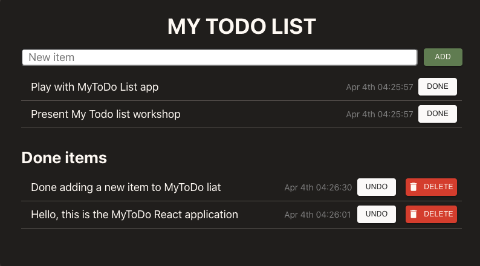
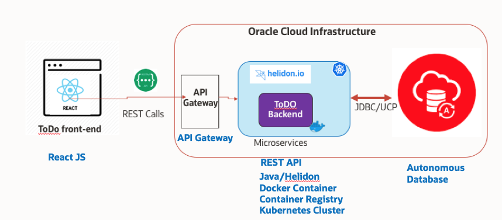

# MyToDoReact version 1.0.
Copyright (c) 2021 Oracle, Inc.

Licensed under the Universal Permissive License v 1.0 as shown at https://oss.oracle.com/licenses/upl/

## My ToDo List React application for Java developers

Learn how to deploy a simple Cloud native application using the most commonly used frameworks and the Oracle Cloud Infrastructure services.

You will will learn how to use the Autonomous Database, the Container Registry, the Kubernetes Cluster (OKE) , Helidon, and the API Gateway managed services of the Oracle Cloud Infrastructure through the deployment of a simple MyToDo List React JS application.

# Prerequisites

* An Oracle Free Tier, Always Free, Paid or LiveLabs Cloud Account
https://www.oracle.com/cloud/free/
