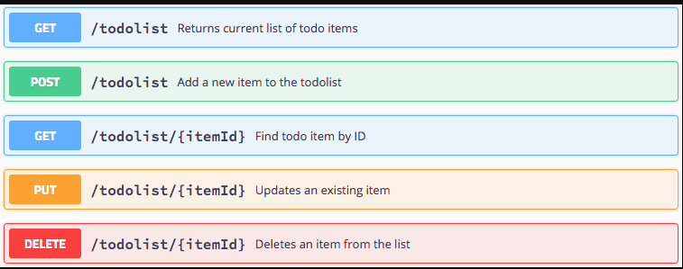
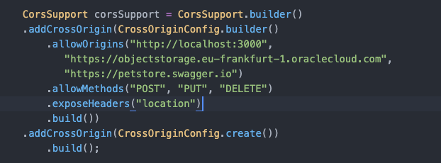
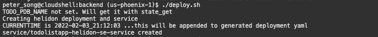
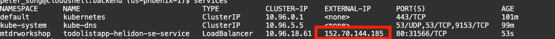
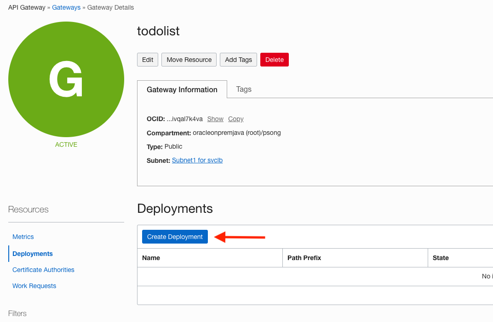
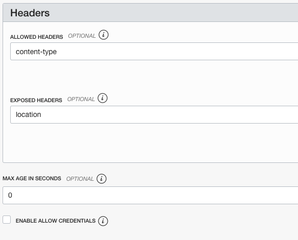

# Backend

## Introduction

In this lab, you will deploy the pre-built Helidon Java backend Docker image to OKE, then configure the API Gateway.

Estimated time: ~25-minutes.

### Objectives

* Build and deploy the Docker image of the application
* Deploy the image on the Oracle Kubernetes Engine (OKE)
* Describe the steps for Undeploying
* Configure the API Gateway
* Test the backend application

### Prerequisites

This lab requires the completion of lab 1 and the provision of the OCI components.

### Understanding the Java/backend application

As with most React applications (https://reactjs.org/), this application uses remote APIs to handle data persistence. The backend implements 5 REST APIs including:
- Retrieving the current list of todo items
- Adding a new todo item
- Finding a todo item by its id
- Updating an existing todo item
- Deleting a todo item.

The APIs are documented using Swagger @ http://130.61.67.158:8780/swagger-ui/#/

The backend is implemented using the following Java classes (under ./backend/src/...):   
- Main.java: starts and configure the main entry points.
- ToDoItem.java: maps a Todo Item instance to/from JSON  document
- ToDoItemStorage.java: stores the Todo item in a persistent store i.e., the Oracle Autonomous database
- ToDoListAppService.java: implements the Helidon service and exposes the REST APIs

  

## **Task 1**: Build and push the Docker images to the OCI Registry

1. Edit ./backend/src/main/java/com/oracle/todoapp/Main.java

    - Locate the following code fragment

    
    - Replace `eu-frankfurt-1` in  `"https://objectstorage.eu-frankfurt-1.oraclecloud.com"` by your region

    - Save the file

2. Run `build.sh` script to build and push the helidon-se image into the repository

    ```
    <copy>cd $MTDRWORKSHOP_LOCATION/backend; ./build.sh</copy>
    ```
  In a couple of minutes, you should have successfully built and pushed the images into the OCIR repository.

3. Check your container registry in your compartment
    - Go to the Console, click the hamburger menu in the top-left corner and open
    **Developer Services > Container Registry**.
   
   

## **STEP 2**: Deploy on Kubernetes and Check the Status

1. Run the `deploy.sh` script

  ```
  <copy>
  cd $MTDRWORKSHOP_LOCATION/backend 
  ./deploy.sh
  </copy>
  ```

   If everything runs correctly the script will output something like this. 

   


2. Check the status using the following commands

The following command returns the Kubernetes service of MyToDo application with a load balancer exposed through an external API
  ```
  <copy>services</copy>
  ```
  This will run `kubectl get services` in the background, but the setup script creates aliases for ease of use



3. The following command returns all the pods running in your kubernetes cluster:
  ```
  <copy>pods</copy>
  ```
This will run `kubectl get pods` in the background, but the setup script creates aliases for ease of use


5. You can tail the log of one of the pods by running:

  ```
  kubectl -n mtdrworkshop logs -f <pod name>
  ```

  $ kubectl logs -f <pod name>
  Example: `kubectl -n mtdrworkshop logs -f todolistapp-helidon-se-deployment-7fd6dcb778-c9dbv`


  If the logs return `webserver is up!` then you have done everything correctly.
## **STEP 4**: UnDeploy (optional)

  If you make changes to the image, you need to delete the service and the pods by running undeploy.sh then redo Steps 2 & 3.

  1. Run the `undeploy.sh` script
  ```
    <copy>cd $MTDRWORKSHOP_LOCATION/backend; ./undeploy.sh</copy>
  ```
  2. Rebuild the image + Deploy + (Re)Configure the API Gateway


## **STEP 5**: Configure the API Gateway

The API Gateway protects any RESTful service running on Container Engine for Kubernetes, Compute, or other endpoints through policy enforcement, metrics and logging.
Rather than exposing the Helidon service directly, we will use the API Gateway to define cross-origin resource sharing (CORS).

The setup script already creates an API gateway, but you still need to create the deployments in the api gateway.

1. From the hamburger  menu navigate **Developer Services** > **API Management > Create Gateway**
   

2. Click on the todolist gateway that has been created for you
   

3. Create a todolist deployment by clicking create deployment
   

4. Fill out the basic information like so:


5. Configure Cross-origin resource sharing (CORS) policies.
  - CORS is a security mechanism that will prevent running application loaded from origin A  from using resources from another origin B.
  - Allowed Origins: is the list of all servers (origins) that are allowed to access the API deployment typically your Kubernetes cluster IP.
  - Replace the `.us-phoenix-1` portion with whichever region you replaced with in task 1.
  - Replace the 3rd IP address with the external IP address of your Load Balancer
  - Allowed methods: GET, PUT, DELETE, POST, OPTIONS are all needed.

  To configure CORS, scroll down and click add next to CORS and fill in this information under allowed origins

  

6. Configure the Headers

    

7. Configure the routes: we will define two routes:
  - /todolist for the first two APIs: GET, POST and OPTIONS

  

- /todolist/{id} for the remaining three APIs: (GET, PUT and DELETE)


## **STEP 6**: Testing the backend application through the API Gateway

1. Navigate to the newly create Gateway Deployment Detail an copy the endpoint
   

2. Testing through the API Gateway endpoint
  postfix the gateway endpoint with "/todolist" as shown in the image below

   

  It should display the Todo Item(s) in the TodoItem table that was created during the setup.

Congratulations, you have completed lab 2; you may now [proceed to the next lab](#next).

## Acknowledgements

* **Author** -  - Kuassi Mensah, Dir. Product Management, Java Database Access, Peter Song Developer Advocate JDBC
* **Contributors** - Jean de Lavarene, Sr. Director of Development, JDBC/UCP
* **Last Updated By/Date** - Peter Song Developer Advocate  February 2022
