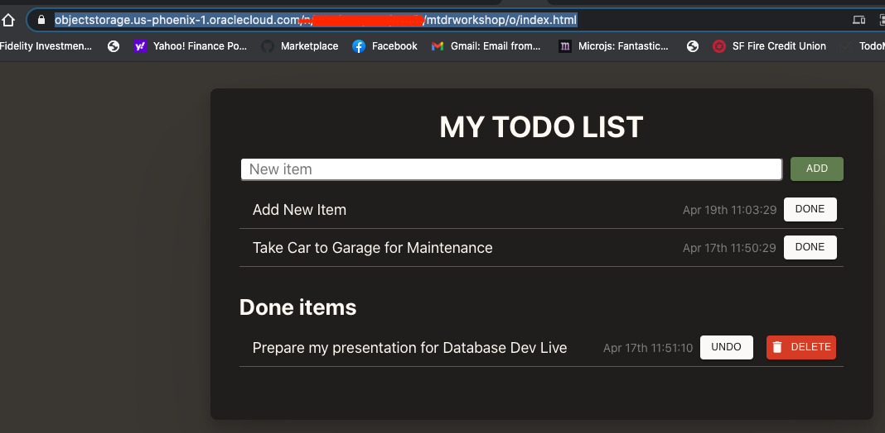

# Frontend (ReactJS)

## Introduction

In this lab you will deploy a pre-built ReactJS application locally then build it for production an host it on the Oracle Cloud Infrastucture.

Estimated Lab Time: 15-minutes

### Objectives

In this lab, you will:
- Clone the workshop git repository on your laptop
- Set the API Gateway endpoint
- Run the ReactJS frontend code in Dev Mode then Build for Production
- Host the production build on the Oracle Cloud's object storage

### Understanding the ReactJS application

The application is simple; it uses Functional Components with State Hooks for managing states. There is a main component called "App" which renders another component called "NewItem" and two tables of todo items: the active ones and the already done ones. The "NewItem" component displays the text field to add a new item.

The App component includes the "items" state ([]) which contains the list of todo items. When setItems is called with a new array of items the component will re-render.

The App component also maintains the following states:

- "isLoading" is true when waiting for the backend to return the list of items.We use this state to display a spinning wheel while loading.

- "isInserting" is true when waiting for the backend to process a new insert item. The "Add" button will display a spinning wheel during this time.

- "error" stores the error messages received during the API calls.

The index.css file contains all the styles for the application.

### Prerequisites

**Everything from Prerequisites - Task 2 should be done locally on your laptop**

1. This lab requires the completion of lab 1 and 2

2. You will be using the npm command, make sure it is installed

  ```
  <copy>npm --version</copy>
  ```

  if not please install Node for your laptop, using the following
  link: `https://bit.ly/3evGlEo`.

3. The lab requires also Go lang.

  "go version" -> `go version go1.15.2 darwin/amd64`

  ```
  <copy>go version</copy>
  ```
If not installed, please install Go (see https://golang.org/doc/)

## **Task 1**: Configure API.js

This project was bootstrapped with [Create React App](https://github.com/facebook/create-react-app).

1. clone again the git repository to a directory on your laptop (we only need the front end in this lab)
  ```
  <copy>git clone https://github.com/peterrsongg/oci-react-samples.git</copy>
  ```

2. cd frontend

3. Run the following npm commands to install the required packages

  ```
  <copy>npm install --save typescript</copy>
  ```
  ```
  <copy>npm install</copy>
  ```
  - In case of errors, try the following command
 ```
 <copy>npm audit fix --force</copy>
 ```
  - Ideally, npm -version should return > 6.14.x AND Node version > 14.16.x
  If npm version < 6.14.x then install the latest Node using
   https://bit.ly/3evGlEo

4. Update API_LIST in API.js

  - Make sure to be in frontend/src directory
 ```
 <copy>cd frontend/src</copy>
 ```
 - In the Cloud console, navigate to **Developer Services > API Management**
 - Click on your Gateway and go to Deployment
 - Copy the Deployment Endpoint
 - Paste the endpoint as the value of API_LIST and append "/todolist"

  Example  
  const API_LIST = 'https://xxxxxxxxxx.apigateway.eu-frankfurt-1.oci.customer-oci.com/todolist';

  - Save the modified API.js file

## **STEP 2**: Run in Dev Mode then Build for Production

1. In the project directory, run the app in the development mode <br />

  ```
  <copy>npm start</copy>
  ```

2. Open [http://localhost:3000](http://localhost:3000) to view it in the browser.

3. The page will reload if you make edits.<br />
   You will also see any lint errors in the console.

4. Cancel the developer mode execution and build the app for production to the `build` folder. This will create a folder named `build` for you<br />

- Issue "Ctrl-c" to cancel the developer mode executions

- Execute npm run build
  ```
  <copy>npm run build</copy>
  ```
It correctly bundles React in production mode (into the build folder) and optimizes the build for the best performance.

  

The build is minified and the filenames include the hashes.<br />
Your app is ready to be deployed!

See the section about [deployment](https://facebook.github.io/create-react-app/docs/deployment) for more information.

## **STEP 3**: Hosting on the Oracle Cloud's object storage

1. Open up the hamburger menu in the top-left corner of the Console and select
**Object Storage > Object Storage**.

  
    - Create the 'mtdrworkshop' (or another name if that's taken) bucket

  

  Enter in the bucket details.
  

  Edit visibility to public

  
2. Install the Staci utility for copying directories to OCI object storage
   bucket with folder hierarchies

  - git clone https://github.com/maxjahn/staci.git

  ```
  <copy>git clone https://github.com/maxjahn/staci.git</copy>
  ```

  - cd staci

  ```
  <copy>cd staci</copy>
  ```

  - go get -d

  ```
  <copy>go get -d</copy>
  ```

  - go build

  ```
  <copy>go build</copy>
  ```

3. Upload a static build into the bucket, using the staci binary.
`-source build` should be the path to `build` from `npm run build` earlier. `-target mtdrworkshop` should be the name of the bucket

```
<copy>./staci/staci -source build -target mtdrworkshop</copy>
```

- The application is visible in the 'mtdrworkshop' bucket of your tenancy

- Click on the index.html object and copy the URL of the index object

  

- You may now run the application from Object store, using the URL of the index that you've copied above.

  


## Acknowledgements

* **Authors** -  Kuassi Mensah, Dir. Product Management, Java Database Access
* **Contributors** - Jean de Lavarene, Sr. Director of Development, JDBC/UCP
* **Last Updated By/Date** - Kuassi Mensah, Database Product Management,  April 2021
