# Setup Dev Environment

## Introduction

In this  lab, you will configure your development environment and collect information that will be used later throughout this workshop.

Estimated Lab Time: ~25 minutes

### Objectives

* Launch Cloud Shell
* Download the workshop code and scripts from GitHub
* Set up an OCI Compartment and install a two nodes OKE cluster
* Create the ATP database, the user schema and a database table
* Install GraalVM  
* Create an OCI Registry and Auth key
* Access OKE from the Cloud Shell

### Prerequisites

- This lab requires an [Oracle Cloud account](https://www.oracle.com/cloud/free/). You may use your own cloud account, a cloud account that you obtained through a trial, a Free Tier account, or a LiveLabs account.

## **STEP 1**: Launch the Cloud Shell and Clone mtdrworkshop GitHup repository

1. Launch Cloud Shell

  The Cloud Shell is a small virtual machine running a Bash shell which you access through the OCI Console. It comes with a pre-authenticate CLI pre-installed and configured so you can immediately start working in your tenancy without having to spend time on installation and configuration!

  Click the Cloud Shell icon in the top-right corner of the Console.
  

2. Clone the GitHub repo and move up the `mtdrworkshop` directory.

    ````
    <copy>
    git clone https://github.com/oracle/oci-react-samples.git
    </copy>
    ````
    Then
    ````
    <copy>
    cd ~/oci-react-samples; mv mtdrworkshop ..</copy>
    ````

    You should now see `mtdrworkshop` in your root directory

3. Change to the mtdrworkshop directory:

      ```
      <copy>cd ~mtdrworkshop</copy>

      ```
4. Set the execution mode for all Shell scripts

    ```
    <copy>chmod +x *.sh */*.sh</copy>
    ```

NOTE: THE CLOUD SHELL WILL DISCONNECT AFTER A CERTAIN PERIOD OF INACTIVITY.

IF YOU ARE DISCONNECTED OR LOGGED OFF AND RETURN TO CLOUD SHELL, MAKE SURE YOU ARE IN THE ~/mtdrworkshop DIRECTORY.

## **STEP 2**: Create an OCI compartment and an OKE cluster in that compartment

1. Open up the hamburger menu in the top-left corner of the Console and select **Identity > Compartments**.

  

2. Click **Create Compartment** with the following parameters then click **Create Compartment**:

    

    - Compartment name: `mtdrworkshop`
    - Description: `My ToDo React workshop compartment`

    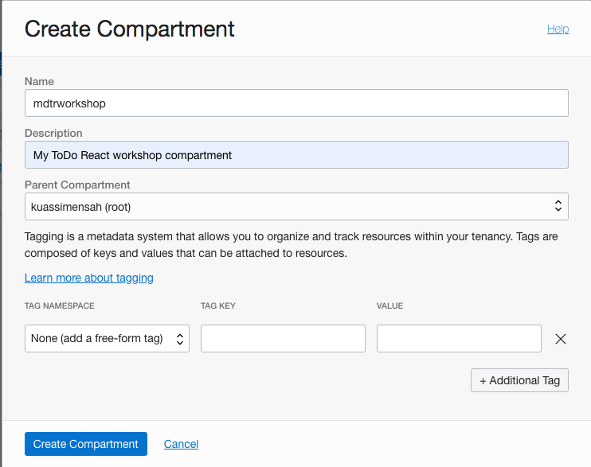

3. Once the compartment has been created, click the name of the compartment and
   then click **Copy** to copy the OCID.

    

    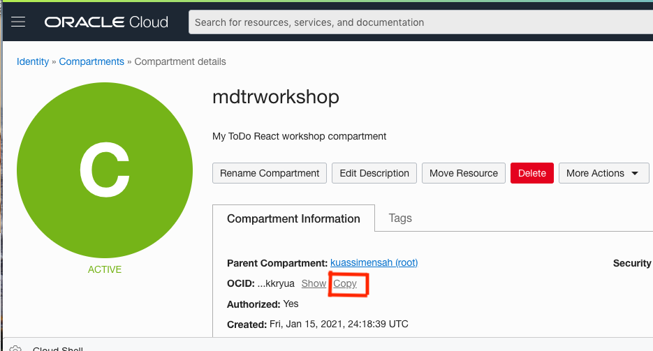

4. Go back into your cloud shell and verify you are in the `~/mtdrworkshop` directory.

5. Run `./setCompartmentId.sh <COMPARTMENT_OCID> <REGION_ID>` where your `<COMPARTMENT_OCID>` and `<REGION_ID>` values are set as arguments.

      For example:

       `./setCompartmentId.sh ocid1.compartment.oc1..aaaaaaaaxbvaatfz6yourcomparmentidhere5dnzgcbivfwvsho77myfnqq us-ashburn-1`

6.  To create an OKE cluster, return to the OCI console and open up the hamburger button in the top-left corner of the Console and go to **Developer Services > Kubernetes Clusters**.

    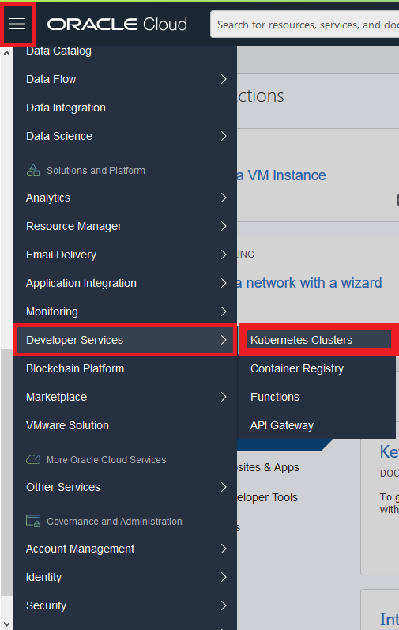

7. Make sure you are in the newly created compartment and click **Create Cluster**.
     (Please use the default schema in the unlikely situation that the newly created compartment is not quickly visible on the left pickler)
    

8. Choose **Quick Create** as it will create the new cluster along with the new network resources such as Virtual Cloud Network (VCN), Internet Gateway (IG), NAT Gateway (NAT), Regional Subnet for worker nodes, and a Regional Subnet for load balancers. Click **Launch Workflow**.

    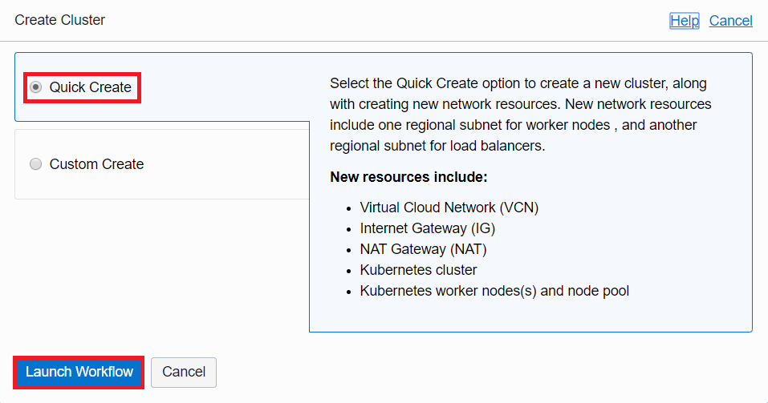

9. Change the name of the cluster to `mtdrworkshopcluster`, accept all the other defaults, and click **Next** to review the cluster settings.


10. Once reviewed click **Create Cluster**, and you will see the resource creation progress.

    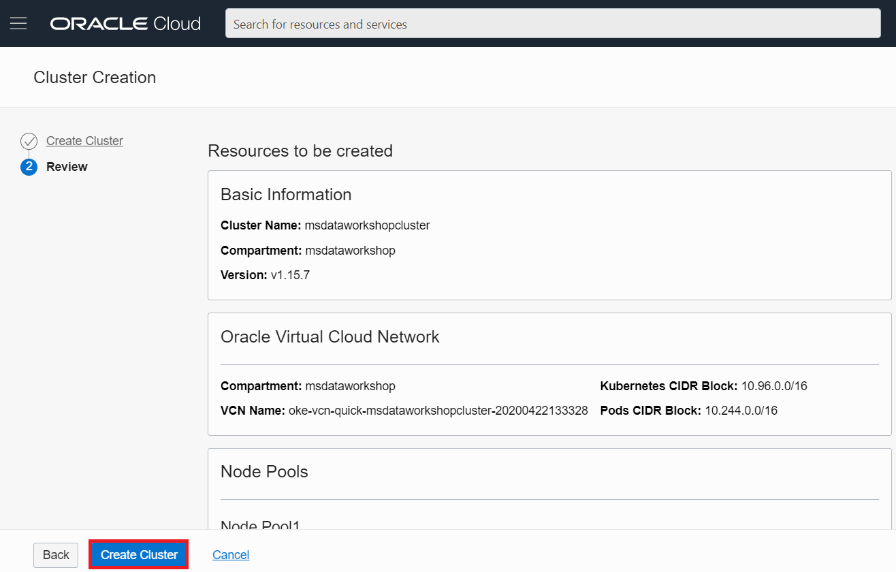

11. Close the creation window once you can.

    

12. Once launched it should usually take around 5-10 minutes for the cluster to be fully provisioned and the Cluster Status should show Active.

    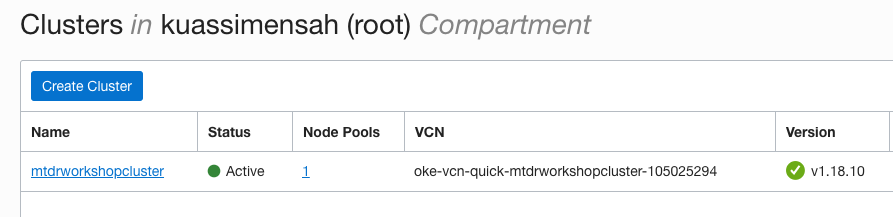

    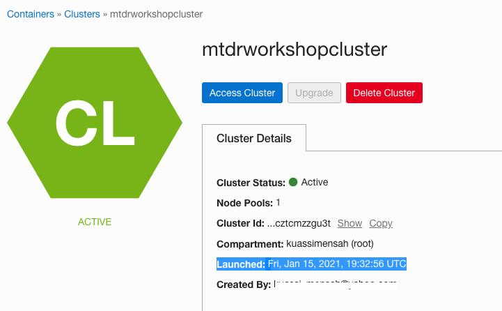

        _There is no need to wait for the cluster to be fully provisioned at this point as we will verify cluster creation and create a kube config in order to access it in a later step._


## **STEP 3**: Create the ATP database, TODOUSER and the TODOITEM table

1. Open up the hamburger menu in the top-left corner of the Console and select **Autonomous Transaction Processing**.

    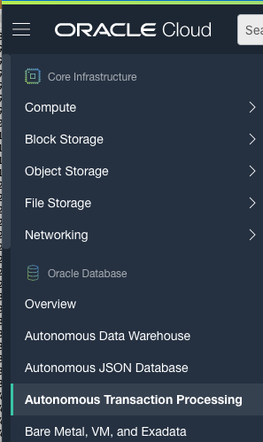

2. Click on **Create Autonomous Database**.

    

3. Set **Compartment, Database Name and Display Name**.

  - Set the workload type to "Transaction Processing".
  - Accept the default deployment type i.e., "Shared Infrastructure".

    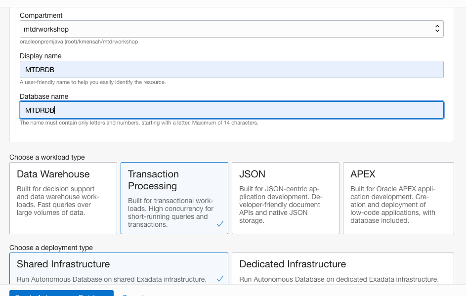

    4. Set **ADMIN password, Network Access Type and License Type**
    - Set the database ADMIN password (12 to 30 characters, at least one uppercase letter, one lowercase letter, and one number) and confirm.
    Please note the ADMIN password; it will be required later.
    - Set the Network Access type to "Allow secure access from specific IPs an VCNs".
    - Set the license type to "Bring Your Own License (BYOL)" (does not matter for this workshop)
    - Click on "Create Autonomous Database"

    

The database creation will take a few minutes.

5. Populate mtdrworkshopdbid.txt with the database OCID
    - Create  the `~/mtdrworkshop/workingdir/mtdrworkshopdbid.txt` file.
    ```
    <copy>touch ~/mtdrworkshop/workingdir/mtdrworkshopdbid.txt</copy>
    ```

    - Copy the OCID of the newly created database from the Cloud console and
    add it into `~/mtdrworkshop/workingdir/mtdrworkshopdbid.txt` file.

    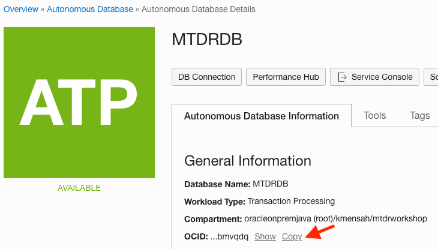

6. Generate the Wallet for your ATP Connectivity

   - Still in Cloud Shell, make sure you are in the
      `~/mtdrworkshop/setup-dev-environment` directory.

   - Copy the following command and replace $OCID by the
     copied OCID.

     ```
     <copy>./generateWallet.sh $OCID</copy>
     ```
   - Execute generateWallet.sh ocid1.autonomousdatabase.oc1.phx.abyhqlj....

      You will be requested to enter a password for wallet encryption, this is separate for the ADMIN password but you could reuse the statement.
      A wallet.zip file will be created in the current directory.

7. Create TODOUSER using sql utility in Cloud shell

  - Stay in mtdrwokshop/setup-dev-environment directory and launch
     sql with /nolog option

    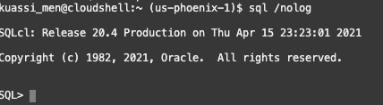

  - Point the tool at your wallet.zip file
      SQL> set cloudconfig wallet.zip

     SQL> show tns
    

  - Connect to mtdrdb_tp service, as database ADMIN user (remember the
       password given to ADMIN above)

      SQL> connect ADMIN@mtdrdb_tp

  - Create TODOUSER (replace <password> by a strong password).

        ```
        <copy> CREATE USER todouser IDENTIFIED BY <password> DEFAULT TABLESPACE data QUOTA UNLIMITED ON data;</copy>
        ```
   - Grant some privileges to TODOUSER by executing the following command
        ```
        <copy>grant create session, create view, create sequence, create procedure, create table, create trigger, create type, create materialized view to todouser;</copy>
        ```
  - Connect as TODOUSER
        SQL> connect todouser@mtdrdb_tp

  - Create TODOITEM table

         Copy the following command in the Worksheet and execute.
         ```
         <copy>CREATE TABLE todoitem (
           id NUMBER GENERATED ALWAYS AS IDENTITY,
           description VARCHAR2(4000),
           creation_ts TIMESTAMP WITH TIME ZONE DEFAULT CURRENT_TIMESTAMP,
           done NUMBER(1,0),
           PRIMARY KEY (id)
          );</copy>
         ```
  - Insert the first row, manually into TODOITEM table
        ```
        <copy>insert into todoitem  (description) values ('Manual item insert');</copy>
        ```
      Then commit the inserted row
        ```
        <copy>commit;</copy>
        ```

## **STEP 4**: Create an OCI Registry and Auth key
    You are now going to create an Oracle Cloud Infrastructure Registry and an Auth key. The Oracle Cloud Infrastructure Registry is an Oracle-managed registry that enables you to simplify your development-to-production workflow by storing, sharing, and managing development artifacts such as Docker images.

1. Open up the hamburger menu in the top-left corner of the console and go to **Developer Services > Container Registry**.

  

2. Take note of the namespace (for example, `axkcsk2aiatb` shown in the image below).

  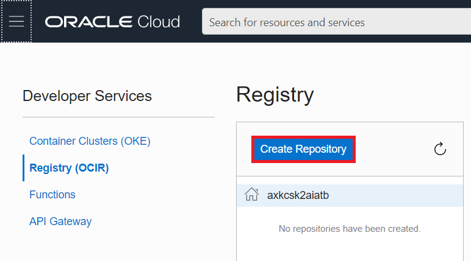

 Click **Create Repository** , specify the following details for your new repository, and click **Create Repository**.
 - Repository Name: `<tenancy name>/mtdrworkshop`
 - Access: `Public`

  Go to Cloud Shell and run `./addOCIRInfo.sh` with the namespace and repository name as arguments

    ```
      <copy>./addOCIRInfo.sh <namespace> <repository_name></copy>
    ```
  For example `./addOCIRInfo.sh axkcsk2aiatb mtdrworkshop.user1/mtdrworkshop`.

3. You will now create the Auth token by going back to the User Settings page. Click the Profile icon in the top-right corner of the Console and select **User Settings**.

    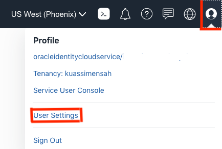

4. Click on **Auth Tokens** and select **Generate Token**.

    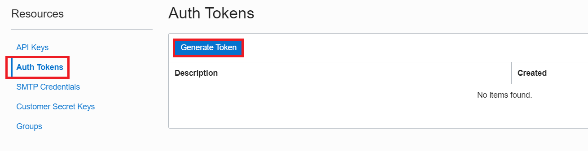

5. In the description type `mtdrworkshoptoken` and click **Generate Token**.

    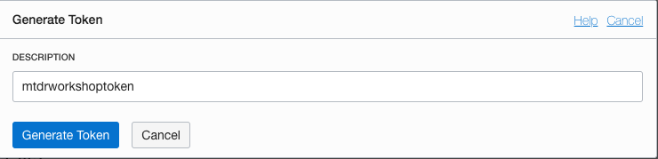

6. Copy the token value.

    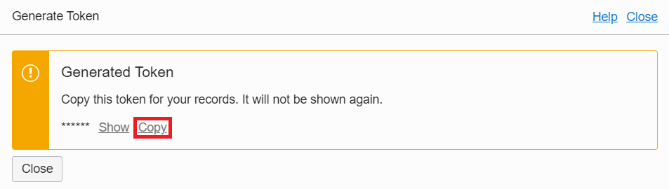

7. Go to Cloud Shell, at the workshop root directory and run the
   dockerLogin.sh scripts ...
 `./dockerLogin.sh  <USERNAME> "<AUTH_TOKEN>"` where

  * `<USERNAME>` - is the username used to log in (typically your email address). If your username is federated from Oracle Identity Cloud Service, you need to add the `oracleidentitycloudservice/` prefix to your username, for example `oracleidentitycloudservice/firstname.lastname@something.com`

  * `"<AUTH_TOKEN>"` - paste the generated token value and enclose the value in quotes.

  For example `dockerLogin.sh user.foo@bar.com "8nO[BKNU5iwasdf2xeefU;yl"`.

8. Once successfully logged into Container Registry, we can list the existing docker images. Since this is the first time logging into Registry, no images will be shown.

    ```
    <copy>docker images </copy>
    ```
## **STEP 5**: Install GraalVM in Cloud Shell

 We will be using JDK 11 in Cloud Shell to build the Java/Helidon image
1.  Set some environment variables and run the following commands

    ```
    <copy>export MTDRWORKSHOP_LOCATION=~/mtdrworkshop</copy>
    ```
    ```
    <copy>export WORKINGDIR=$MTDRWORKSHOP_LOCATION/workingdir</copy>
    ```  
   - Make sure to be in mtdrwokshop/setup-dev-environment directory then execute the following script
    ```
    <copy>./installGraalVM.sh</copy>
    ```

## **STEP 6**: Access OKE from the Cloud Shell

1. Create the mtdrworkshop/workingdir/mtdrworkshopclusterid.txt file

    ```
    <copy>touch mtdrworkshop/workingdir/mtdrworkshopclusterid.txt</copy>
    ```
2. Navigate to **Developer Services > Kubernetes Clusters**

3. Copy the mdtrworkshopcluster id and paste into the newly created file
  


3. Run `./verifyOKEAndCreateKubeConfig.sh`

    ```
    <copy>./verifyOKEAndCreateKubeConfig.sh</copy>
    ```

 Notice `/.kube/config` is created for the OKE cluster.

  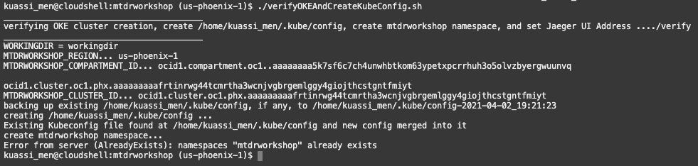

## **STEP 7**: Configuring Network Security Rules

1. The network security rules control the inbound (Ingres) and the outbound (Egress) traffic. As we will be configuring the API Gateway in Part II, we will not set tight security rules at the Kubernetes cluster level.

2. Navigate to **Developer Services > Kubernetes Clusters**
   - Click on the **mtdrworkshopcluster**.

3. Click on VCN Name

    
4. Click on  the VCN named starting with oke-svclbsubnet-quick-mtdrworkshpcluster
    

5. Click on the existing security list
    

6. Add an Ingress Rule
  Set the Destination CIDR  as indicated (leave other fields as is) then Click `Add Ingress Rules`

    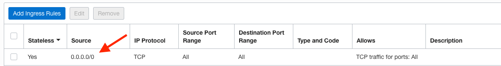

7. Add an Egress Rule
  Set Stateless and Destination CIDR as indicated in the image (leave other fields as-is) then Click `Add Egress Rules`

  

Congratulations, you have completed lab 1; you may now [proceed to the next lab](#next).

## Acknowledgements

* **Author** -  - Kuassi Mensah, Dir. Product Management, Java Database Access
* **Contributors** - Jean de Lavarene, Sr. Director of Development, JDBC/UCP
* **Last Updated By/Date** - Kuassi Mensah, Database Product Management,  April 2021
