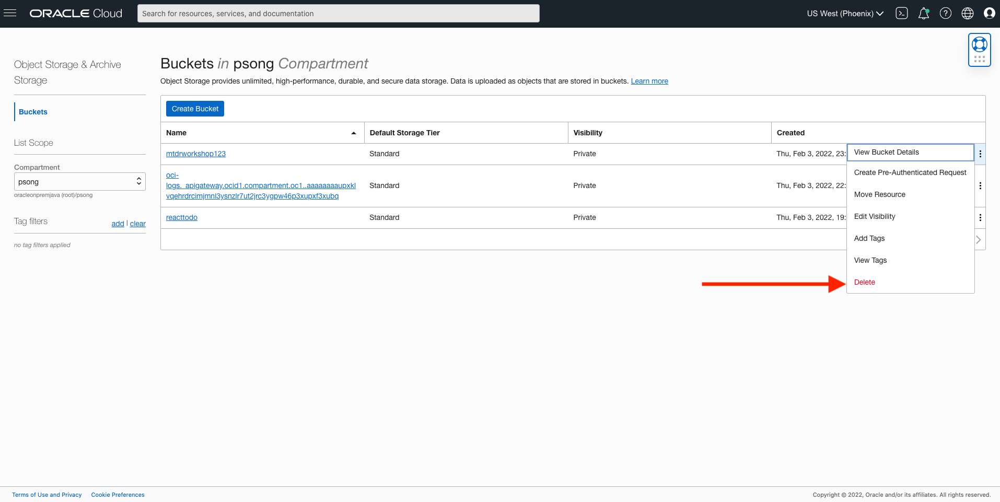

# Teardown workshop resources

## Introduction
In this lab, we will tear down the resources created in your tenancy and the directory in the Oracle cloud shell

Estimated time: 10 minutes

### Objectives
- Delete object storage bucket created in Lab 3
- Delete deployment created in Lab 3
- Run destroy script
- edit ~/.bashrc
### Prerequisites
- Have successfully completed the earlier labs


## Task 1: Delete Workshop Resources
The resources in this task weren't created during the setup script, so we must delete them manually before running the destroy script.

1. Since the mtdrworkshop bucket created in Lab 3 wasn't created by the setup script, the destroy script does not know of it and we need to delete it ourselves

    

2. We can't run the destroy script when there's a deployment in the api gateway. Navigate to Gateway, click on the deployment and click delete.

    

## Task 2: Run the Destroy Script

1. Run the following command to delete the resources created in your tenancy. It will delete everything except the compartment, and may take several minutes to run.

```
<copy>
cd $MTDRWORKSHOP_LOCATION
source destroy.sh
</copy>
```
## Task 3: Delete the Directory

1. Once the destroy script is completed, delete the directory in your cloud shell where you installed the workshop

```
<copy>
cd $HOME
rm -rf <directory_name>
</copy>
```

## Task 4: Edit ~/.bashrc

1. We need to remove the line we added to ~/.bashrc in Lab 1. Run the following command to remove
```
<copy>
vi ~/.bashrc
</copy>
```
2. Once you're inside ~/.bashrc, delete this line 

    ```echo source $(pwd)/env.sh >> ~/.bashrc```

## Task 5: Delete the Compartment

1. In the Oracle Cloud Console, navigate to the **compartments** screen in the **Identity** section. Select the compartment that was created for the workshop (if you didn't provide one) and delete it

## Acknowledgements

* **Authors** -  Kuassi Mensah, Dir. Product Management, Java Database Access; Peter Song, Developer Advocate JDBC
* **Original Authors** - Richard Exley, Consulting Member of Technical Staff, Oracle MAA and Exadata; Peter Song, Developer Advocate, JDBC;
* **Last Updated By/Date** - Peter Song, Developer Advocate JDBC
