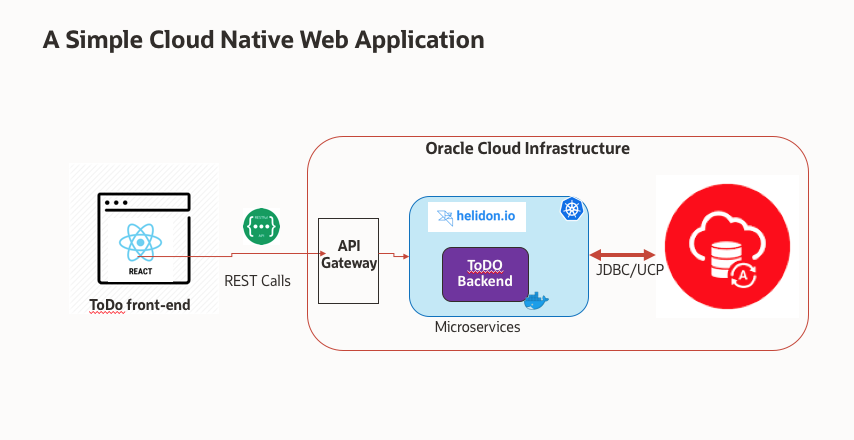

# MyToDoReact version 1.0.
Copyright (c) 2021 Oracle, Inc.

Licensed under the Universal Permissive License v 1.0 as shown at https://oss.oracle.com/licenses/upl/

# My ToDo List React application for Java developers
## Introduction and Overview

In this workshop, you will deploy a simple Cloud native application using the most commonly used frameworks and the Oracle Cloud Infrastructure services.

You will will learn how to use the Autonomous Database, the Container Registry, the Kubernetes Cluster (OKE) , Helidon, and the API Gateway managed services of the Oracle Cloud Infrastructure through the deployment of a simple MyToDo List React JS application.

## Let's Get Started!

This lab has 3 parts however, you need first to setup a Cloud account
## **STEP 1**: Sign up for a Free Trial Cloud Account
Click on [Sign Up For a Free Trial](?lab=sign-up-for-free-trial) to get your Oracle Free Trial. If you already have an Oracle Free Trial or Paid account, you can proceed to [Part 1: Setup Dev Environment](?setup-dev-environment/README.md).

## Want to Learn More?

* [https://developer.oracle.com/](https://developer.oracle.com/)

## Acknowledgements
* **Workshop by** - Kuassi Mensah, Dir. Product Management, Java Database Access
* **Application by** - Jean de Lavarene, Sr. Director of Development, JDBC/UCP
* **Original scripts by** - Paul Parkinson, Developer Evangelist, Microservices

## Need Help?
Please submit feedback or ask for help using this [LiveLabs Support Forum](https://community.oracle.com/tech/developers/categories/building-microservices-with-oracle-converged-database). Please login using your Oracle Sign On and click the **Ask A Question** button to the left.  You can include screenshots and attach files.  Communicate directly with the authors and support contacts.  Include the *lab* and *step* in your request.
